  <picture>
    <source media="(prefers-color-scheme: dark)" srcset="assets/dark.svg">
    <source media="(prefers-color-scheme: light)" srcset="assets/light.svg">
    
  </picture>

 

  
  
  
  

 

---

## ⚡ About Me

Results-driven **Cloud & DevOps Engineer** with hands-on experience building and maintaining **CI/CD pipelines**, automating **infrastructure provisioning (IaC)**, and deploying secure, scalable, and highly available systems on **AWS**.

- 🔭 Currently seeking roles as **Cloud Engineer**, **DevOps Engineer**, **IT Infrastructure Specialist**, or **Linux Administrator**.
- 🌐 Live Interactive Portfolio: **[sathiyananthperiyasamy.github.io](https://sathiyananthperiyasamy.github.io)**
- 🎓 **B.E. Computer Science & Engineering** — Kongunadu College of Engineering and Technology (**CGPA: 8.68 / 10** — *First Class Distinction*).
- 🏅 **AWS DevOps Training Program** (*Grade "A"* — SLA Institute) & **AWS Certified Cloud Practitioner** (CLF-C02).
- ⚡ Strong emphasis on system reliability, multi-tier isolation, DevSecOps Quality Gates (SonarQube), and automated smoke testing.

---

## 🛠️ Tech Stack & Core Competencies

| Category | Technologies & Tools |
| :--- | :--- |
| **Cloud Platform (AWS)** | Amazon EC2, VPC & Subnets, IAM, S3, ALB/ELB, Auto Scaling (ASG), Amazon RDS, CloudWatch, SNS, SQS, Lambda |
| **CI/CD & DevSecOps** | Jenkins, GitHub Actions, SonarQube SAST, GitHub Webhooks, Maven, Git & GitHub |
| **Containers & Orchestration** | Docker, Docker Compose, Kubernetes (k8s), Nginx Reverse Proxy |
| **Infrastructure as Code** | Terraform, Ansible |
| **Linux & Networking** | Ubuntu, Amazon Linux Administration, DNS, TCP/IP, Load Balancers, SSH, Security Groups |
| **Scripting & Automation** | Bash / Shell Scripting, Python |

---

## 🏗️ Featured Architectural Projects

### 1️⃣ [Netflix Full-Stack & DevSecOps CI/CD Pipeline](https://github.com/SathiyananthPeriyasamy/Netflix-clone-project)
> **AWS EC2 | Jenkins | SonarQube | Docker & Compose | Nginx | React 18 | Node.js Express | MongoDB | GitHub Actions**
- **Architected Dual CI/CD Pipelines** running Jenkins and GitHub Actions with GitHub Webhook triggers.
- **Integrated SonarQube SAST Code Quality Gates** for automated security vulnerability scanning prior to deployment.
- **Configured Multi-Stage Docker Builds** orchestrating MongoDB, Express API, and Nginx reverse proxy using Docker Compose.
- **Automated Live Smoke Testing** via HTTP `curl` health check scripts validating frontend (`:80`) and REST API (`/api/health`).

### 2️⃣ Highly Available 3-Tier Web Architecture
> **AWS VPC | EC2 | ALB | Auto Scaling | RDS Private Subnet | NAT Gateway | Python Flask | MySQL | CloudWatch**
- **Designed Multi-AZ AWS Infrastructure** spanning Public, Private, and Isolated Database Subnets with ALB load balancing.
- **Automated Server Provisioning & Database Security** securing MySQL RDS instances in private subnets with ingress restrictions.
- **Configured Proactive CloudWatch Health Monitoring** and SNS notifications for automated failover and system metrics.

### 3️⃣ Automated CI/CD Pipeline Architecture
> **AWS EC2 | Ansible | Jenkins | Docker | Tomcat | Maven | Java | Git | GitHub Webhooks | Bash**
- **Automated Infrastructure Provisioning** using Ansible playbooks as Infrastructure as Code (IaC).
- **Engineered Event-Driven Jenkins Pipeline** triggered automatically via GitHub Webhooks upon code push.
- **Automated Container Delivery** using Docker containerization for instant production server updates.

---

## 📜 Certifications

- 🏅 **AWS DevOps Training Program** — *Grade "A"* — SLA Institute *(May 2026)*
- 📜 **AWS Certified Cloud Practitioner (CLF-C02)** — *Udemy* *(Feb 2026)*

---

## 📬 Connect With Me

- 📧 **Email**: [sathiyananthp@gmail.com](mailto:sathiyananthp@gmail.com)
- 💼 **LinkedIn**: [linkedin.com/in/sathiyananthp](https://www.linkedin.com/in/sathiyananthp)
- 📸 **Instagram**: [instagram.com/iamsathiyananth](https://www.instagram.com/iamsathiyananth?stkn=YWJpdzdhOXRneWZ3)
- 🌐 **Portfolio**: [sathiyananthperiyasamy.github.io](https://sathiyananthperiyasamy.github.io)

---

  Built with ❤️ for High-Performance Cloud Architecture &amp; DevSecOps Engineering.

